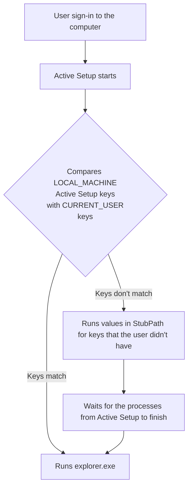
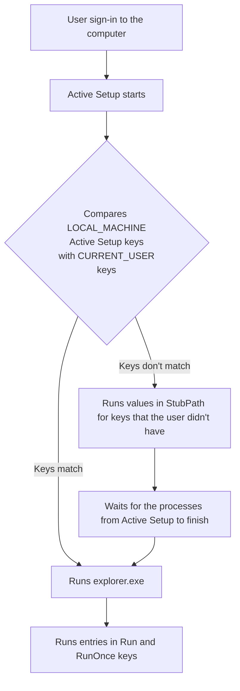

# Active Setup
Active Setup allows us to execute commands once per user after successful sign-in to the computer.

## Registry key locations
#### <b>Machine</b>
* <b>HKEY_LOCAL_MACHINE</b>\SOFTWARE\Microsoft\Active Setup\\<b>Installed Components</b>
* <b>HKEY_LOCAL_MACHINE</b>\SOFTWARE\WOW6432Node\Microsoft\Active Setup\\<b>Installed Components</b>
#### <b>Current user</b>
* <b>HKEY_CURRENT_USER</b>\SOFTWARE\Microsoft\Active Setup\\<b>Installed Components</b>
* <b>HKEY_CURRENT_USER</b>\SOFTWARE\Wow6432Node\Microsoft\Active Setup\\<b>Installed Components</b>

## Active Setup order of execution


## Running cmd commands from Active Setup
```powershell
REG ADD "HKLM\SOFTWARE\Microsoft\Active Setup\Installed Components\RunCMD" /v StubPath /t REG_SZ /d "cmd /c echo Running from HKLM\Active Setup && whoami && pause"
```

```powershell
REG ADD "HKLM\SOFTWARE\Microsoft\Active Setup\Installed Components\RunCMD" /v Version /t REG_SZ /d "1,1,1,1"
```

## Running cmd commands from Active Setup and RunOnce registry



```powershell
ni "HKLM:\SOFTWARE\Microsoft\Active Setup\Installed Components\RunCMDFromRunOnce" | New-ItemProperty -Name "StubPath" -Value 'REG ADD "HKCU\Software\Microsoft\Windows\CurrentVersion\RunOnce" /v RunCMD /t REG_SZ /d "cmd /c echo Running from HKCU\RunOnce && whoami && pause"'
```

## Installing Brave with Active Setup and Run Once
Download link: [Brave](https://github.com/brave/brave-browser) <br />

```powershell
ni "HKLM:\SOFTWARE\Microsoft\Active Setup\Installed Components\InstallBraveFromRunOnce" | New-ItemProperty -Name "StubPath" -Value 'REG ADD "HKCU\Software\Microsoft\Windows\CurrentVersion\RunOnce" /v InstallBrave /t REG_SZ /d "cmd /c echo installing software.. && cmd /c C:\BraveBrowserStandaloneSilentSetup.exe"'
```

### My other videos
[Windows Registry: Run and RunOnce](https://youtu.be/zgFzCq5uEPw) <br />
