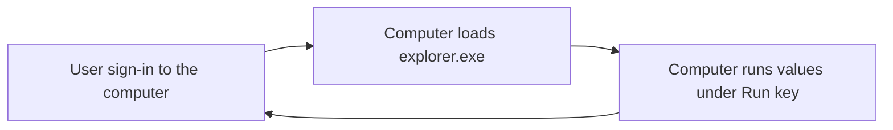
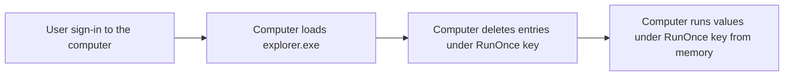

# Run and RunOnce

<b>Documentation:</b> [Run and RunOnce Registry Keys](https://learn.microsoft.com/en-us/windows/win32/setupapi/run-and-runonce-registry-keys) <br />

# Short info
Run and RunOnce allows us to run applications, commands, and scripts after user successfuly sign-in to the computer.

## Registry key locations
* <b>HKEY_CURRENT_USER</b>\Software\Microsoft\Windows\CurrentVersion\\<b>Run</b>
* <b>HKEY_CURRENT_USER</b>\Software\Microsoft\Windows\CurrentVersion\\<b>RunOnce</b>
* <b>HKEY_LOCAL_MACHINE</b>\Software\Microsoft\Windows\CurrentVersion\\<b>Run</b>
* <b>HKEY_LOCAL_MACHINE</b>\Software\Microsoft\Windows\CurrentVersion\\<b>RunOnce</b>

## Run vs RunOnce
* <b>Run</b> - Computer runs <b>values</b> under <b>Run</b> key after users successfuly sign-in to the computer.

* <b>RunOnce</b> - Computer <b>first deletes</b> the <b>entries</b> under <b>RunOnce</b> key are deleted after users sign-in to the computer and then computer runs the values.


## HKEY_LOCAL_MACHINE vs HKEY_CURRENT_USER
* <b>CURRENT_USER</b> - Runs the values only for the user that have the registry entries
* <b>HKEY_LOCAL_MACHINE</b>
    * <b>Run</b> - Runs the values for all users on the computer after they sign-in
    * <b>RunOnce</b> - Runs the values for all users on the computer after they sign-in, but it <b>WORKS ONLY FOR ADMINISTRATOR GROUP MEMEBERS</b>

# Examples
## Runing CMD in HKCU
```powershell
REG ADD "HKCU\Software\Microsoft\Windows\CurrentVersion\RunOnce" /v RunCMD /t REG_SZ /d "cmd /c echo Running from HKCU\RunOnce && whoami && pause"
REG ADD "HKCU\Software\Microsoft\Windows\CurrentVersion\Run" /v RunCMD /t REG_SZ /d "cmd /c echo Running from HKCU\Run && whoami && pause"
```

## Installing Brave using RunOnce
Download link: [Brave](https://github.com/brave/brave-browser) <br />

```powershell
REG ADD "HKCU\Software\Microsoft\Windows\CurrentVersion\RunOnce" /v InstallBrave /t REG_SZ /d "cmd /c echo installing software.. && cmd /c C:\BraveBrowserStandaloneSilentSetup.exe"
```

## Uninstalling Brave using RunOnce
```powershell
REG ADD "HKCU\Software\Microsoft\Windows\CurrentVersion\RunOnce" /v RemoveBrave /t REG_SZ /d "cmd /c echo removing software.. && cmd /c powershell.exe -Command ""& {$remove = Get-ItemPropertyValue -Path 'HKCU:\Software\Microsoft\Windows\CurrentVersion\Uninstall\BraveSoftware Brave-Browser' -Name UninstallString; cmd /c $($remove) --force-uninstall}"""
```

## Runing CMD in HKLM
```powershell
# RunOnce in HKLM works only on administrator accounts
REG ADD "HKLM\Software\Microsoft\Windows\CurrentVersion\RunOnce" /v RunCMD /t REG_SZ /d "cmd /c echo Running from HKLM\RunOnce && whoami && pause"
REG ADD "HKLM\Software\Microsoft\Windows\CurrentVersion\Run" /v RunCMD /t REG_SZ /d "cmd /c echo Running from HKLM\Run && whoami && pause"
```
